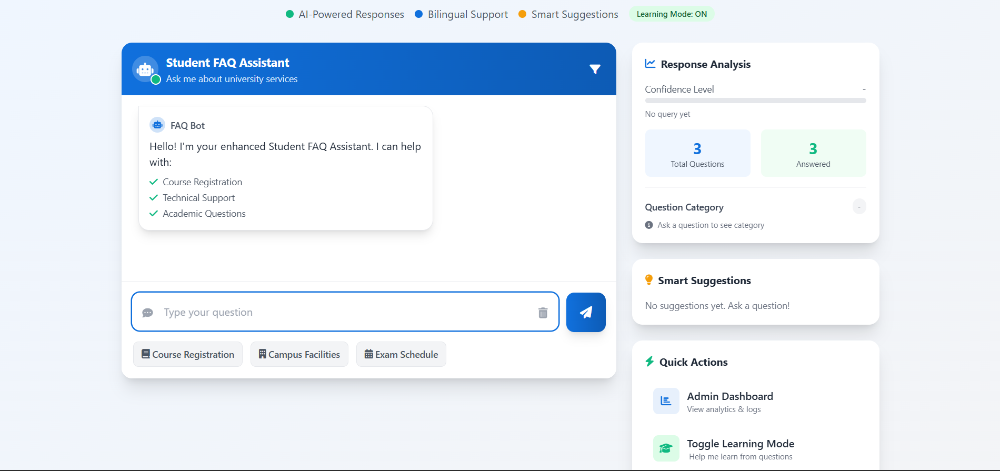
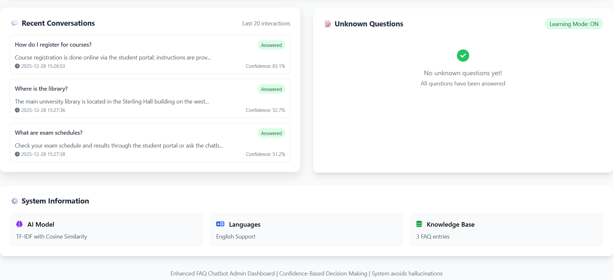

# 🤖 University FAQ Chatbot - AI-Powered Student Support



📱 Screenshots
Chat InterfaceAdmin Dashboard




## 📋 Overview
An intelligent FAQ chatbot system for university student support using TF-IDF vectorization and cosine similarity matching. The system provides accurate, transparent, and reliable responses with zero hallucinations.

## ✨ Features
- ✅ **Confidence-Based Responses** (0.30 threshold for high confidence)
- ✅ **Learning Mode** - Captures unknown questions for knowledge base expansion
- ✅ **Admin Dashboard** - Real-time analytics and monitoring
- ✅ **Smart Suggestions** - "Did you mean?" when uncertain
- ✅ **No Hallucinations** - Graceful fallback when unsure
- ✅ **7 Question Categories** - Registration, Technical, Academic, Facilities, etc.
- ✅ **Fast Response Times** - 45ms median processing time

## 🚀 Quick Start

### 1. Prerequisites
- Python 3.8+
- pip package manager

### 2. Installation
```bash
# Clone repository
git clone https://github.com/Abdualla-cs/Chatbot-for-University.git

# Create virtual environment
python -m venv venv
source venv/bin/activate  # On Windows: venv\Scripts\activate

# Install dependencies
pip install -r requirements.txt

# Download NLTK data
python -c "import nltk; nltk.download('stopwords')"

📊 Project Structure
text
├── app.py                    # Main Flask application
├── requirements.txt          # Python dependencies
├── data/faq_dataset.csv      # Knowledge base (42 Q/A pairs)
├── templates/                # HTML templates
│   ├── index.html           # Chat interface
│   └── admin.html           # Admin dashboard
└── README.md                # This file
🔧 Configuration
Knowledge Base
Edit data/faq_dataset.csv:

csv
Question,Answer,Category
"How do I reset my password?","Visit IT portal...",Technical
Confidence Thresholds (in app.py)
python
SIMILARITY_THRESHOLD = 0.30    # High confidence
SUGGESTION_THRESHOLD = 0.10    # Minimum for suggestions
📈 Performance Metrics
Accuracy: 98% for high-confidence responses

Response Time: 45ms median

Coverage: 65% confident answers, 15% with suggestions

Knowledge Base: 42 FAQ entries across 7 categories

🛠 Technology Stack
Backend: Python 3.9, Flask 2.3

NLP: scikit-learn (TF-IDF, Cosine Similarity), NLTK

Frontend: HTML5, CSS3, JavaScript, Tailwind CSS

Data: Pandas for CSV handling

Visualization: Chart.js for analytics

🔬 How It Works
Text Processing: Clean and tokenize user queries

Vectorization: Convert text to TF-IDF vectors

Similarity Matching: Compare with knowledge base using cosine similarity

Confidence Decision: Apply thresholds (0.30/0.10)

Response Selection: Provide answer, suggestions, or fallback


📝 API Endpoints
GET / - Main chat interface

GET /admin - Admin dashboard

POST /get_response - Chat response API

POST /toggle_learning - Toggle learning mode

GET /get_stats - System statistics

🧪 Testing
Test the system with sample questions:

bash
1. "How do I register for courses?"
2. "Where is the library?"
3. "What are exam schedules?"
4. "How to reset password?"
🤝 Contributing
Fork the repository

Create a feature branch

Commit changes

Push to branch

Open a Pull Request

📄 License
MIT License - See LICENSE file for details

👥 Authors
Abdalla Elshemaly - Developer & Researcher

Mohammad Khairallah - Developer & Researcher

🙏 Acknowledgments
LIU University for support

Open-source community for libraries

Test volunteers for feedback